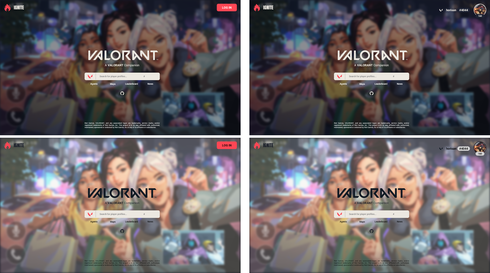

 
# IGNITE
A companion web application project utilizing a VALORANT API to pull information from the game regarding: agents, maps, players, etc.

Contributions from [Uyen](https://github.com/nguyeud) and [Duc](https://github.com/illumki).

## Mockups

## Legal
Riot Games, VALORANT, and any associated logos are trademarks, service marks, and/or registered trademarks of Riot Games, Inc. This project is in no way affiliated with, authorized, maintained, sponsored or endorsed by Riot Games, Inc or any of its affiliates or subsidiaries.